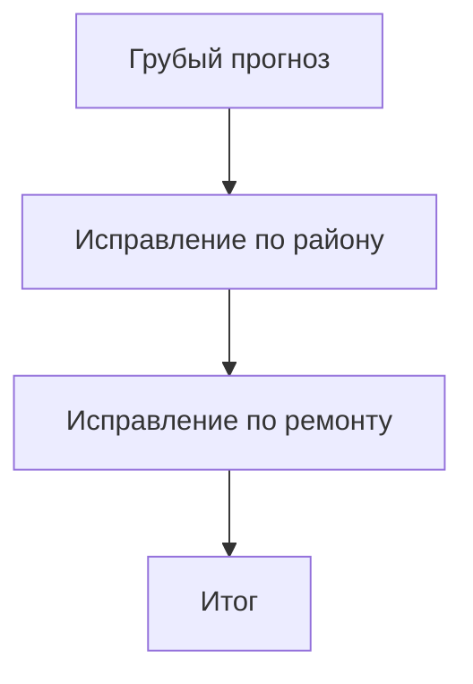
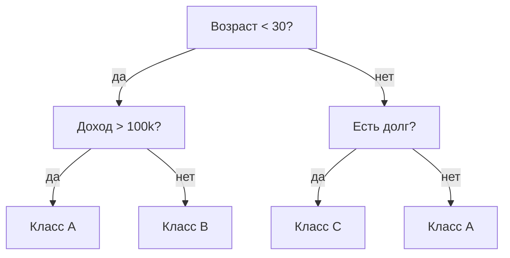

# Градиентный бустинг на деревьях решений

### Что это такое, где используется и как выбрать библиотеку

<div class="pt-8 text-base">
  <span class="px-3 py-1 rounded bg-blue-600 text-white mr-2">Catboost</span>
  <span class="px-3 py-1 rounded bg-green-600 text-white mr-2">XGBoost</span>
  <span class="px-3 py-1 rounded bg-purple-600 text-white mr-2">LightGBM</span>
</div>

---
notes: |
  Здесь важно дать определение без перегруза.
  Подчеркну две идеи:
  первое — это ансамбль,
  второе — деревья добавляются последовательно.
  В отличие от леса, здесь модели зависят друг от друга.
  Можно сформулировать просто: каждое следующее дерево делает поправку к уже существующему прогнозу.
---

# 1. Что такое градиентный бустинг

- **Ансамблевый метод**: итоговая модель состоит из многих деревьев
- Деревья строятся **последовательно**, а не независимо
- Каждое новое дерево **исправляет ошибки** предыдущих
- **Итог**: сильная модель из набора **простых базовых моделей**

<div class="pt-6">


</div>

<div class="pt-3 text-sm opacity-80">
На табличных данных это один из самых сильных практических подходов.
</div>

---
notes: |
  Это самый важный интуитивный слайд.
  Главное донести, что бустинг не строит одну идеальную модель сразу.
  Он постепенно добавляет небольшие уточнения.
  На устном выступлении можно сказать:
  первое дерево ловит общий тренд,
  второе — систематическую ошибку,
  третье — остаточную ошибку.
---

# 2. Пример: как модели исправляют ошибки

### Пример: прогноз цены квартиры

<div class="pt-3 text-sm opacity-80">

- **Дерево 1**: даёт грубую оценку по площади
- **Дерево 2**: замечает, что центр города систематически недооценён
- **Дерево 3**: добавляет поправку на ремонт

</div>

<div class="grid grid-cols-2 gap-6 pt-3">
<div>

#### Было:

<div class="pt-3 pb-3 text-sm opacity-80">

- базовый прогноз: `10.0 млн`

</div>

#### Поправки:

<div class="pt-3 pb-3 text-sm opacity-80">

- район: `+2.0 млн`
- ремонт: `+0.8 млн`

</div>

#### Итог:

<div class="pt-3 pb-3 text-sm opacity-80">

- `12.8 млн`

</div>

</div>
<div>



</div>
</div>

<div class="pt-4 text-sm opacity-80">
Итоговый ответ — это сумма последовательных уточнений.
</div>

---
notes: |
  Здесь можно объяснить, почему деревья так популярны в табличном ML.
  Они хорошо делят пространство признаков и автоматически учитывают нелинейные эффекты.
  Это особенно удобно на реальных таблицах, где признаки разнородные:
  числовые, бинарные, категориальные, с пропусками.
---

# 3. Почему именно деревья решений

- Хорошо работают с **табличными данными**
- Умеют ловить **нелинейности** и **взаимодействия признаков**
- Обычно не требуют сложного **масштабирования**
- Подходят как **слабые базовые модели**
- Часто устойчивы к «грязным» реальным данным

<div class="pt-5 grid grid-cols-2 gap-4 text-sm">
<div>

**На практике это даёт:**

- быстрый baseline
- меньше feature engineering
- хорошее качество в бизнес-задачах

</div>
<div>



</div>
</div>

---
notes: |
  На этом слайде важно подчеркнуть различие между параллельным и последовательным обучением.
  Bagging и Random Forest уменьшают variance за счёт усреднения.
  Boosting идёт шаг за шагом и часто лучше снижает общую ошибку модели.
  Если времени мало, можно запомнить так:
  лес — независимые деревья,
  бустинг — цепочка деревьев-поправок.
---

# 4. Boosting vs одно дерево vs Random Forest

| Подход | Как строятся модели | Идея |
|---|---|---|
| **Одно дерево** | Одна модель | Просто одно дерево |
| **Bagging** | Параллельно | Усреднение независимых моделей |
| **Random Forest** | Много независимых деревьев | Bagging для деревьев |
| **Boosting** | Последовательно | Новые деревья исправляют ошибки |

<div class="pt-4 text-sm">

- **Одно дерево** — просто и интерпретируемо, но нестабильно
- **Random Forest** — хорошо снижает разброс
- **Boosting** — часто даёт лучшее качество на таблицах

</div>

---
notes: |
  Здесь задача простая: показать широту применения.
  Можно быстро пройтись по трём классам задач:
  классификация, регрессия и ранжирование.
  Подчеркнуть, что именно на табличных данных бустинг стал де-факто стандартом.
---

# 5. Где используется градиентный бустинг

<div class="grid grid-cols-3 gap-4 pt-2 text-sm">
<div class="border border-gray-400/40 rounded p-3">
<b>Классификация</b>

- скоринг
- антифрод
- churn prediction
</div>

<div class="border border-gray-400/40 rounded p-3">
<b>Регрессия</b>

- цена
- спрос
- выручка
</div>

<div class="border border-gray-400/40 rounded p-3">
<b>Ранжирование</b>

- поиск
- рекомендации
- ad ranking
</div>
</div>

<div class="pt-6">

- Часто показывает **очень сильные результаты на табличных данных**
- Один из первых кандидатов для **baseline** и production-модели

</div>

---
notes: |
  Здесь не нужно уходить глубоко в математику.
  Формула нужна только как краткая визуальная опора:
  итоговая модель — сумма деревьев.
  Слово "градиентный" объясняю интуитивно:
  мы добавляем дерево в направлении уменьшения ошибки.
---

# 6. Общий принцип работы

### Модель строится как сумма деревьев

$$
F(x) = \sum_{m=1}^{M} \gamma_m h_m(x)
$$

<div class="pt-4 text-sm opacity-80">

- $h_m(x)$ — очередное дерево
- $\gamma_m$ — его вклад
- $M$ — число итераций

</div>

---
notes: |
  Это практический слайд.
  Лучше всего кратко объяснить четыре главных ручки:
  learning rate, число итераций, глубина и регуляризация.
  Можно дать короткое правило:
  маленький learning rate + больше деревьев обычно безопаснее.
  И обязательно сказать, что бустинг легко переобучается без валидации.
---

# 7. Гиперпараметры и переобучение

<div class="text-sm">

| Параметр | На что влияет |
|---|---|
| `learning_rate` | размер шага |
| `n_estimators` / `iterations` | число деревьев |
| `max_depth` / `depth` | сложность дерева |
| `num_leaves` | сложность дерева в LightGBM |
| `subsample`, `colsample_bytree` | регуляризация через подвыборки |

</div>

<div class="grid grid-cols-2 gap-6 text-sm">
<div>

**Почему бывает overfitting**

- слишком много деревьев
- слишком глубокие деревья
- большой learning rate

</div>
<div>

**Как бороться**

- early stopping
- уменьшать глубину
- уменьшать learning rate
- использовать subsample / colsample

</div>
</div>

---
notes: |
  XGBoost можно описать как надёжный классический выбор.
  Если не знаете, с чего начать, это почти всегда хороший baseline.
  Но важно сказать, что для категорий он обычно менее удобен, чем CatBoost.
---

# 8. XGBoost

<div class="grid grid-cols-2 gap-6 text-sm">
<div>

**Идея**

- зрелая и эффективная реализация бустинга
- сильный и надёжный baseline

**Плюсы**

- стабильно высокое качество
- хорошая документация
- сильная регуляризация

**Минусы**

- категории часто требуют encoding
- на больших данных не всегда самый быстрый

</div>
<div>

**Категориальные признаки**

- чаще делают preprocessing

**Скорость**

- высокая

**Когда выбирать**

- нужен проверенный инструмент
- важна зрелость экосистемы
- нужен production baseline

</div>
</div>

---
notes: |
  Пример кода
---

# 8. XGBoost

<div class="pt-4">

```python
from xgboost import XGBClassifier
from sklearn.datasets import load_iris
from sklearn.model_selection import train_test_split

data = load_iris()
X_train, X_test, y_train, y_test = train_test_split(
  data['data'], 
  data['target'], 
  test_size=0.2,
)

model = XGBClassifier(
  n_estimators=2, 
  max_depth=2, 
  learning_rate=1, 
  objective='binary:logistic',
)

model.fit(X_train, y_train)
preds = model.predict(X_test)
```

</div>

---
notes: |
  LightGBM — это история про скорость и масштаб.
  На больших таблицах он очень часто удобен.
  Но важно предупредить, что из-за более агрессивного роста деревьев он может переобучаться,
  если не ограничивать глубину, листья и число итераций.
---

# 9. LightGBM

<div class="grid grid-cols-2 gap-6 text-sm">
<div>

**Идея**

- быстрый бустинг для больших данных
- использует leaf-wise рост деревьев

**Плюсы**

- очень высокая скорость
- хорошая масштабируемость
- сильное качество

**Минусы**

- чувствителен к тюнингу
- может сильнее переобучаться

</div>
<div>

**Категориальные признаки**

- поддерживаются, но не так удобно, как в CatBoost

**Скорость**

- очень высокая

**Когда выбирать**

- большой датасет
- важно быстро обучаться
- есть время на настройку

</div>
</div>

---
notes: |
  Пример кода
---

# 9. LightGBM

<div class="pt-4">

```python
from lightgbm import LGBMClassifier
from sklearn.datasets import load_iris
from sklearn.model_selection import train_test_split

data = load_iris()
X_train, X_test, y_train, y_test = train_test_split(
  data['data'], 
  data['target'], 
  test_size=0.2,
)

model = LGBMClassifier(
    n_estimators=2, 
    num_leaves=31,
    learning_rate=0.05,
)

model.fit(X_train, y_train)
preds = model.predict(X_test)
```

</div>

---
notes: |
  CatBoost особенно полезен в реальных бизнес-данных, где много категорий:
  города, тарифы, сегменты клиентов, типы товаров.
  Его сильная сторона — хорошее качество с минимальной ручной подготовкой.
  Поэтому для практики это часто первый кандидат.
---

# 10. CatBoost

<div class="grid grid-cols-2 gap-6 text-sm">
<div>

**Идея**

- бустинг, удобный для данных с категориями
- сильная встроенная работа с категориальными признаками

**Плюсы**

- часто хорошо работает из коробки
- меньше ручной подготовки
- сильный baseline для бизнес-таблиц

**Минусы**

- не всегда самый быстрый
- иногда тяжелее по ресурсам

</div>
<div>

**Категориальные признаки**

- главное преимущество CatBoost

**Скорость**

- хорошая

**Когда выбирать**

- много категориальных признаков
- нужен быстрый и сильный baseline
- хочется меньше feature engineering

</div>
</div>

---
notes: |
  Пример кода
---

# 10. CatBoost

<div class="pt-4">

```python
from catboost import CatBoostClassifier
from sklearn.datasets import load_iris
from sklearn.model_selection import train_test_split

data = load_iris()
X_train, X_test, y_train, y_test = train_test_split(
  data['data'], 
  data['target'], 
  test_size=0.2,
)

model = CatBoostClassifier(
    iterations=2, 
    depth=6,
    learning_rate=0.05,
)

model.fit(X_train, y_train)
preds = model.predict(X_test)
```

</div>

---
notes: |
  Это ключевой сравнительный слайд.
  Я бы проговорил его очень коротко:
  XGBoost — зрелость,
  LightGBM — скорость,
  CatBoost — категории и удобство.
  Этого достаточно, чтобы аудитория вынесла практический ориентир.
---

# 11. Сравнение библиотек

| Критерий | XGBoost | LightGBM | CatBoost |
|---|---|---|---|
| Скорость | высокая | очень высокая | средняя / высокая |
| Качество | высокое | очень высокое | очень высокое |
| Категории | чаще нужен encoding | поддержка есть | лучшая поддержка |
| Удобство | высокое | среднее / высокое | высокое |
| Тюнинг | средний | выше среднего | ниже среднего |
| Когда брать | надёжный baseline | большие данные | много категорий |

<div class="pt-4 text-sm opacity-80">
Универсального победителя нет: лучший вариант зависит от данных и ограничений задачи.
</div>

---
notes: |
  На финальном содержательном слайде нужно дать простые правила выбора.
  Это самое полезное для практики:
  CatBoost — категории,
  LightGBM — большие данные и скорость,
  XGBoost — стабильный универсальный baseline.
  И добавить, что бустинг не всегда лучший выбор для неструктурированных данных.
---

# 12. Когда и что лучше брать?

<div class="grid grid-cols-2 gap-8 text-sm">
<div>

**CatBoost**

- много категорий
- быстрый baseline из коробки

**LightGBM**

- большой датасет
- нужна высокая скорость

**XGBoost**

- нужен стабильный, проверенный инструмент
- важна зрелая экосистема

</div>
<div>

**Когда бустинг не лучший выбор**

- сырые изображения / текст / звук
- нужна максимально простая интерпретация
- нужны другие архитектуры, например DL

**Запомнить**

1. Бустинг — один из лучших методов для таблиц
2. Деревья исправляют ошибки друг друга
3. Выбор библиотеки зависит от данных

</div>
</div>

---
layout: center
class: text-center
notes: |
  В конце можно не только ответить на вопросы, но и самому предложить несколько направлений обсуждения.
  Это помогает, если аудитория сначала молчит.
  Если будет время, полезно отдельно обсудить:
  1) как валидировать бустинг,
  2) как использовать early stopping,
  3) как интерпретировать важность признаков через SHAP.
---

# Спасибо за внимание!

### Вопросы?
